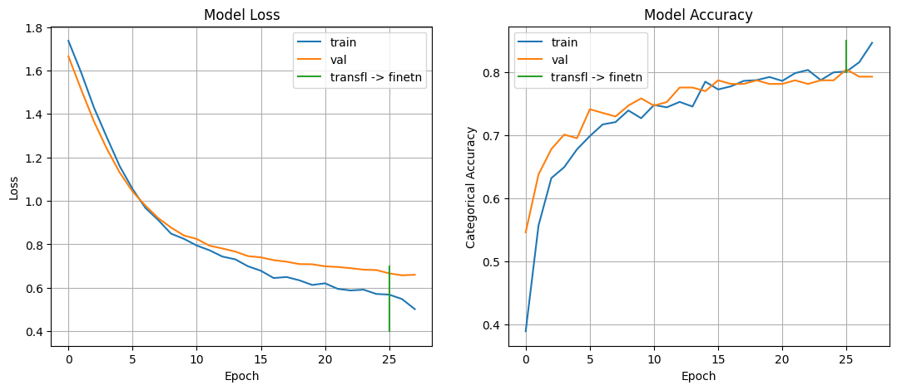

# Research - Project Hunter

In this research the problem of classifying projects into categories based on title and description was approached and techniques to solve the problem were investigated. The main technology used was NLP -- natural language processing.

## Methodology

First, an ample research was made to answer certain questions such as:
- What techniques, using AI or not, are adequate to solve the problem?
- Is the dataset sufficiently large for AI applications?
- What types of input would a model need to achieve good performance?

These questions will be detailed and answered later on.

Then, some AI-based approaches that could solve the problem were selected. For each one, cross-validation was used to determined the performance of certain model and parameter combinations. Cross-validation consists in splitting the dataset in `k` folds and using `k-1` folds as the training set and `1` fold as a test set. Then a different fold is picked as a test set until all folds are test sets only once.

After that, a model was trained using the best parameters and tested against a test split of the dataset.

Finally, results were registered on tables and possible future research was discussed.

## Experiments and Results

Below are the questions made (and their answers):

1. What are the viable solutions, with or without AI?
- Solutions without AI would involve plenty of manual processing of the texts and a statistical modelling of the problema, and we realized it would not be a viable path. There are various possible solutions with AI, but only some were considered: 1) fine-tuning a pre-trained model for text embedding extraction and 2) manual splitting of text into tokens for embedding generation and 3) usage of ChatGPT in some way. Number 2 was tested on early experiments but the data pre-processing was laborious and the models had around 50% accuracy, so the approach was dropped.

2. What tools would be needed? Which are already built? What's the cost? Can a whole web page be used as input instead of pre-selected text?
- For a complete solution, tools such as Snowflake can be used to host the database/dataset, Streamlit can be used to present results, AWS can be used to host models and crawling and scraping services and TensorFlow or PyTorch can be used as frameworks to train and deploy models. Snowflake and AWS are paid services. Future experiments that are out of the scope of this research would have to be made to try and use a whole page as an input to a model; we only experimented with titles and descriptions of projects that are already in a database.

3. What statistical methods would be important to reduce sample space?
- The less redundant and more significant words and phrases that describe the project the better.  If tags are to be used, something between 5 and 50 could be generated initially and then linearly dependent variables could be eliminated using Pearson's correlation, for example.

4. What is the minimum number of samples a database needs to allow experiments in: finance/impact/area/city/year/subarea?
- This is the most complex question, seen as there is no simple answer. Deep down, the number of samples depends on the problem's underlying statistical model. We don't know this model, and it certainly is of high complexity. Is the model were to be simple, we could use few features and relatively few samples, but being a complex problem, and making use of AI, a large database is necessary. Two empirical guesses were picked: 1) 5000 samples per class (based on the book [Deep Learning](https://www.deeplearningbook.org/)) or 2) 10x the degrees of freedom (trainable parameters) of the model. The latter is more incertain because the model that ends up being used depends on the statistical complexity of the problem, as was mentioned before, and a model of millions of trainable parameters could be adequate to the problem. A conclusion was reached that a database of at least 1000 samples would be adequate to run performance tests on AI tools.

5. How should the database be constructed (number of tags, number of areas) to maximize performance?
- See answer above.

6. What outputs are easier to obtain?
- Some variables are binary and therefore of less complexity, such as high impact project and social/green/climate financing. Other outputs that are easily obtained with scraping are city and year of the project. Area and subarea are outputs of higher complexity.

With these answers, our research went deeper in investigating NLP techniques for project area prediction.

### Exploring and Cleaning the Dataset

The project's title and description combined will be used as a single sentence input for the model. Samples lacking data in the title, description or area columns were removed. Also, preliminary tests showed that using all available areas hurt performance due to the severe imbalance of classes. So, for our tests, only areas with more than 100 samples were used. Samples with title or description too short were removed. This results in a dataset with 1158 samples. The cleaning resulted in the following sample count for each area:

| area              |   sample_count |
|:------------------|---------------:|
| transport         |            261 |
| waste management  |            199 |
| renewable energy  |            196 |
| energy efficiency |            178 |
| water management  |            169 |
| buildings         |            155 |

As for the models, we used three english-only models and a multilingual model. For the english model, a language classifier was used to find the non-english samples and Google Cloud Translation API was used to translate the texts to english.

The code for data processing can be found in [data_processing_cdp.ipynb](data_processing_cdp.ipynb) for `2022 Full Cities`.

### Fine-tuning Pre-trained Models for Embeddings Extraction

#### Cross-validation

The methods used are based of the following guides:
- https://www.tensorflow.org/tutorials/keras/text_classification
- https://www.tensorflow.org/tutorials/keras/text_classification_with_hub
- https://pytorch.org/tutorials/beginner/blitz/cifar10_tutorial.html#training-an-image-classifier
- https://pytorch.org/tutorials/beginner/introyt/trainingyt.html
- https://keras.io/guides/transfer_learning/

Cross-validation is mostly used when trying to determine which machine learning or deep learning method will give the best results for our problems. Additionaly, cross-validation can be used to grid-search the optimal parameters for a specific model.

At first, cross-validation was used to determine the performance of applying transfer-learning to certain pre-trained models in Keras and PyTorch. Transfer-learning consists of adding a new FC head following the embeddings and train the head with the base model frozen. For the Keras models, the code can be found in [cross-validation_transfer-learning.ipynb](cross-validation_transfer-learning.ipynb). The `tensorflow-hub` library was used to download the models. For these experiments, we only used the combined title and descriptions columns as input and only used pre-trained models + transfer-learning. Further on fine-tuning will evaluated on top of transfer-learning. Variations on the model type were kept but the hidden neurons on the last FC layer were fixed for each model type, as each has a different size for the embeddings vector. The number of neurons was given by `round(sqrt(len(embs)))`. This time, multilingual models were included alongside the english-only models. The number of epochs for each combination was set empirically to avoid overfitting. For the Keras models, the following table was obtained:

| model_type   |   hidden_neurons |   cv_score | params   |
|:-------------|-----------------:|-----------:|:---------|
| nnlm128      |               12 |     0.7306 | 124 M    |
| use          |               24 |     0.7504 | 256 M    |
| use-multi    |               24 |     0.7685 | 68 M     |

The [USE](https://tfhub.dev/google/universal-sentence-encoder/4) architecture is shown to have better accuracy, with the [USE multilingual](https://tfhub.dev/google/universal-sentence-encoder-multilingual/3) model even showing slightly better accuracy but with less than 1/3 of the parameters of the english-only model. The [NNLM](https://tfhub.dev/google/nnlm-en-dim128-with-normalization/2) architecture offered much faster training (and inference) times but with an intermediate number of parameters and lower accuracy. Since real-time execution is not a requirement, inference time is not a problem. It's difficult to make any other conclusions since the accuracy difference is so small as is the dataset.

For the PyTorch models, the code can be found in [cross-validation_sentence-transformers.ipynb](cross-validation_sentence-transformers.ipynb), and the `sentence-transformers` library was used as a source for the models. The same procedure described above was employed, and the following table was obtained:

| model_type   |   hidden_neurons |   cv_score | params   |
|:-------------|-----------------:|-----------:|:---------|
| duse         |               24 |     0.7668 | 135 M    |
| labse        |               28 |     0.7643 | 471 M    |
| minilm       |               20 |     0.7418 | 117 M    |
| mpnet        |               28 |     0.7789 | 278 M    |

The [DUSE](https://huggingface.co/sentence-transformers/distiluse-base-multilingual-cased-v1) model is a distilled USE architecture, and contain less parameters than the original architecture. The variation chosen is multilingual. [LaBSE](https://huggingface.co/sentence-transformers/LaBSE), [MiniLM](https://huggingface.co/sentence-transformers/paraphrase-multilingual-MiniLM-L12-v2) and [MPNet](https://huggingface.co/sentence-transformers/paraphrase-multilingual-mpnet-base-v2) are other architectures with good performance on multilingual tasks and most are based on the [Sentence-BERT](https://arxiv.org/abs/1908.10084) architecture. The MPNet models showed the best accuracy, beating the USE-MULTI models but with 4x more parameters. The other transformer models had slightly lower performance than USE-MULTI.

Now that transfer-learning and sentence transformers performance is established, fine-tuning usually can be done for a few more points in accuracy. As the USE-MULTI architecture showed the best performance per parameters count, only the Keras models will be fine-tuned. The code can be found in [cross-validation_fine-tuning.ipynb](cross-validation_fine-tuning.ipynb). Fine-tuning in our case consists of applying a transfer-learning step as described above and then unfreezing the base model and training the full model with a lower learning rate and for only a few epochs to avoid overfitting, as the full model has way too many parameters for our problems.

| model_type   |   hidden_neurons |   cv_score | params   |
|:-------------|-----------------:|-----------:|:---------|
| nnlm128      |               12 |     0.747  | 124 M    |
| use          |               24 |     0.7686 | 256 M    |
| use-multi    |               24 |     0.7694 | 68 M     |

As predicted, there are smalls gains in performance across all models, with the USE-MULTI model still taking the lead with 76.94% cross-validation accuracy, indicating promising results and that tests with a larger dataset and perhaps a different multilingual model could achieve even better results, as the USE architecture is starting to show it's age compared to other NLP architectures. What also needs to be address to make sure the model performs well is create a separate test set that is independent (not a split) from the ones used in training. This way the model generalization skills could be better evaluated.

#### Training and Testing

To be able to conclude with more certainty that a trained model has good performance, instead of cross-validation, a model was trained using the best parameter combination and was tested against a test split of the dataset. The code can be found in [train_model.ipynb](train_model.ipynb). The proportion used to split the dataset into train, test and validation was `70:15:15`.

The same data processing for the cross-validation is used and a `USE-MULTI` pre-trained model with an FC head with 24 neurons was used. The model performance can seen on the table below:

| set   | accuracy |
|:------|---------:|
| train |   0.8852 |
| val   |   0.7931 |
| test  |   0.7874 |

The training graph is given below:

The green line separates the transfer-learning step from the fine-tuning step. Since the dataset is small, it would be hard for a model to achieve similar train, validation and test accuracy, especially since overfitting can easily happen, and it leads to lack of generalization skills for the model. That said, while the model got close to overfitting with 88.52% train accuracy and a lower 79.31% validation accuracy, good generalization was achieved with 78.74% test accuracy, which is reasonably close to the cross-validation accuracy of 76.94%, but a little higher.

We can also check the confusion matrix for the trained model:

From the matrix we can see that the model struggles to differentiate between the `buildings` and `energy efficiency` areas and to a lesser degree between `energy efficiency` and `renewable energy`. The model has good assertiveness on the `transport`, `waste management` and `water management` areas.

### ChatGPT for Project Web Page Classification

ChatGPT's use was not deeply research seen as the most relevant parts of the tool are paid. Still, the following queries show that there is great potential in investigating this approach.

## Conclusion and Future Work

With 1158 samples and a good grasp of the problem and NLP architectures, a cross-validation accuracy of 76.94% was achieved with a multilingual model while a simple model training achieved 78.74% on the test set. The cross-validation and model training scores show promise but dataset and model improvements could be made in a future research project and with a larger dataset, more accuracy and more generalization skills can be achieved.

Possibilities:

- Expand the dataset (which could include data augmentation techniques). To get more solid conclusions about the use of AI on the problem it is imperative to enlarge the database. While 1158 samples is a good starting amount, when using AI, one will be affected by the "curse of dimensionality": a large amount of data is needed to apply AI to a given problem. [Possible data augmentation techniques](https://neptune.ai/blog/data-augmentation-nlp) include translating the text back and forth to another language so that phrases are slightly different. Also, words can be chosen at random to be replaced by synonyms.

- Exploring other multilingual sentence encoders. Some of the pre-trained models used expect text in english, which requires prior translation of titles and descriptions to english. By using a multilingual model, the translation step was bypassed, and the multilingual model matched the other models performance with relatively less trainable parameters. Other architectures could be explored for further improvement.

- Reducing model size. As we noted above, a smaller model with less trainable parameters achieved similar results as larger models. But even then, the model uses 790 MB when saved to disk. This could be a limiting factor when deploying these models to a cloud service. Pruning and quantization techniques can be applied to the model to reduce its size usually at the expense of accuracy.

- Free or paid solutions involving ChatGPT. As noted on the queries shown above, ChatGPT from OpenAI offers good potential, but before diving in it's dvised to search for other free and paid services that could offer better cost benefit. There are options such as [extracting embeddings from text (or tokens)](https://platform.openai.com/docs/guides/embeddings/what-are-embeddings) or [fine-tuning available models](https://platform.openai.com/docs/guides/fine-tuning) but both are paid options. It should also be investigated if ChatGPT can work with whole web pages (or even only the URL) and from the results create meaningful classifications.
