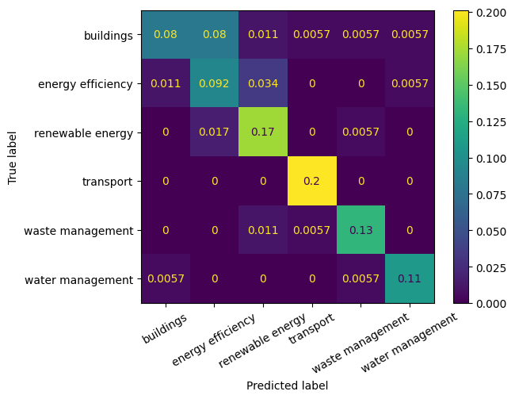

# Research - Project Hunter

In this research the problem of classifying projects into categories based on title and description was approached and techniques to solve the problem were investigated. The main technology used was NLP -- natural language processing.

Also, results from the previous [experiments](old/README.md) were used. Mainly:
- Using the project's title and description combined gave the best results;
- Using fine-tuned pre-trained neural networks gave the best results;
- To showcase the model's potential, the dataset should be as large and balanced as possible.

## Methodology

First, an ample research was made to answer certain questions such as:
- What techniques, using AI or not, are adequate to solve the problem?
- Is the dataset sufficiently large for AI applications?
- What types of input would a model need to achieve good performance?

These questions will be detailed and answered later on.

Then, some AI-based approaches that could solve the problem were selected. For each one, cross-validation was used to determined the performance of certain model and parameter combinations. Cross-validation consists in splitting the dataset in `k` folds and using `k-1` folds as the training set and `1` fold as a test set. Then a different fold is picked as a test set until all folds are test sets only once.

After that, a model was trained using the best parameters and tested against a test split of the dataset.

Finally, results were registered on tables and possible future research was discussed.

## Experiments and Results

Below are the questions made (and their answers):

1. What are the viable solutions, with or without AI?
- Solutions without AI would involve plenty of manual processing of the texts and a statistical modelling of the problema, and we realized it would not be a viable path. There are various possible solutions with AI, but only some were considered: 1) fine-tuning a pre-trained model for text embedding extraction and 2) manual splitting of text into tokens for embedding generation and 3) usage of ChatGPT in some way. Please note number 2 was adressed in the previous experiment so it won't be approached here due to it's inefficiency.

2. What tools would be needed? Which are already built? What's the cost? Can a whole web page be used as input instead of pre-selected text?
- For a complete solution, tools such as Snowflake can be used to host the database/dataset, Streamlit can be used to present results, AWS can be used to host models and crawling and scraping services and TensorFlow or PyTorch can be used as frameworks to train and deploy models. Snowflake and AWS are paid services. Future experiments that are out of the scope of this research would have to be made to try and use a whole page as an input to a model; we only experimented with titles and descriptions of projects that are already in a database.

3. What statistical methods would be important to reduce sample space?
- The less redundant and more significant words and phrases that describe the project the better.  If tags are to be used, something between 5 and 50 could be generated initially and then linearly dependent variables could be eliminated using Pearson's correlation, for example.

4. What is the minimum number of samples a database needs to allow experiments in: finance/impact/area/city/year/subarea?
- This is the most complex question, seen as there is no simple answer. Deep down, the number of samples depends on the problem's underlying statistical model. We don't know this model, and it certainly is of high complexity. Is the model were to be simple, we could use few features and relatively few samples, but being a complex problem, and making use of AI, a large database is necessary. Two empirical guesses were picked: 1) 5000 samples per class (based on the book [Deep Learning](https://www.deeplearningbook.org/)) or 2) 10x the degrees of freedom (trainable parameters) of the model. The latter is more incertain because the model that ends up being used depends on the statistical complexity of the problem, as was mentioned before, and a model of millions of trainable parameters could be adequate to the problem. A conclusion was reached that a database of at least 1000 samples would be adequate to run performance tests on AI tools.

5. How should the database be constructed (number of tags, number of areas) to maximize performance?
- See answer above.

6. What outputs are easier to obtain?
- Some variables are binary and therefore of less complexity, such as high impact project and social/green/climate financing. Other outputs that are easily obtained with scraping are city and year of the project. Area and subarea are outputs of higher complexity.

With these answers, our research went deeper in investigating NLP techniques for project area prediction.

### Exploring and Cleaning the Dataset

Samples lacking data in the title, description or area columns were removed. Also, preliminary tests showed that using all available areas hurt performance due to the severe imbalance of classes. So, for our tests, only areas with more than 100 samples were used. Samples with title or description too short were removed. This results in a dataset with `1560` samples. The cleaning resulted in the following sample count for each area:

| area             |   sample count |
|:-----------------|---------------:|
| transport        |            347 |
| waste management |            315 |
| water management |            269 |
| energy effiency  |            228 |
| renewable energy |            224 |
| buildings        |            177 |

As for the models, we used three english-only models and a multilingual model. For the english model, a language classifier was used to find the non-english samples and Google Cloud Translation API was used to translate the texts to english.

The code for processing data can be found in [data_processing_cdp.ipynb](data_processing_cdp.ipynb) for `2022 Full Cities` and [data_processing_es.ipynb](data_processing_es.ipynb) for `2021 Full Cities`. There are 2 different codes because the column and row format is different for the `2021 Full Cities` and `2022 Full Cities` files provided.

### Fine-tuning Pre-trained Models for Embeddings Extraction

#### Cross-validation

The methods used are based of the following tutorials:
- https://www.tensorflow.org/tutorials/keras/text_classification
- https://www.tensorflow.org/tutorials/keras/text_classification_with_hub

The cross-validation code can be found in [cross_validation.ipynb](cross_validation.ipynb). Running the code and searching for optimal parameters, the following table was obtained:

| Model type   |   Hidden neurons |   CV score |   CV time | Trainable params   |
|:-------------|-----------------:|-----------:|----------:|-------------------:|
| nnlm50       |                0 |     0.8122 |        66 |        48.19 ⋅ 10⁶ |
| nnlm50       |               32 |     0.8077 |        66 |        48.19 ⋅ 10⁶ |
| nnlm128      |                0 |     0.8212 |        63 |       124.64 ⋅ 10⁶ |
| nnlm128      |               64 |     0.8212 |        58 |       124.65 ⋅ 10⁶ |
| use          |                0 |     0.8224 |       227 |       256.80 ⋅ 10⁶ |
| use          |               64 |     0.8128 |       234 |       256.83 ⋅ 10⁶ |
| use-multi    |                0 |     0.8167 |       155 |        68.93 ⋅ 10⁶ |
| use-multi    |               64 |     0.8276 |       159 |        68.96 ⋅ 10⁶ |

The time is given in seconds and is the time necessary to run an iteration (training) of the cross-validation algorithm with that set of parameters. As was mentioned before, for these experiments, we only used the combined title and descriptions columns as input and only used pre-trained models + fine-tuning. Variations on the number of hidden neurons in the last fully-connected layer and the model type were kept, with the inclusion of the multilingual model this time. The number of epochs for each combination was set empirically to avoid overfitting. There is also a smaller table for the model type:

| model_type   |   cv_score |   cv_time | trainable_params   |
|:-------------|-----------:|----------:|-------------------:|
| nnlm128      |    0.8212  |      60.5 |       124.65 ⋅ 10⁶ |
| nnlm50       |    0.80995 |      66   |        48.19 ⋅ 10⁶ |
| use          |    0.8176  |     230.5 |       256.82 ⋅ 10⁶ |
| use-multi    |    0.82215 |     157   |        68.95 ⋅ 10⁶ |

Notice that the models, with or without neurons in the last fully-connected layer, offer similar performance. The [NNLM](https://tfhub.dev/google/nnlm-en-dim128-with-normalization/2) architecture offered much faster training (and inference) times than the [USE](https://tfhub.dev/google/universal-sentence-encoder/4) architecture. The [USE multilingual](https://tfhub.dev/google/universal-sentence-encoder-multilingual/3) model also showed a good balance between model size (number of trainable parameters) and accuracy, while also offering the advantage of being able to deal with 16 languages instead of only english. It's difficult to make any other conclusions since the accuracy difference is so small as is the dataset.

In the end, on average and on a imbalanced dataset, the `USE-MULTI` model achieved `82.22%` cross-validation accuracy, indicating promising results and that tests with a larger dataset and perhaps a different multilingual model could achieve even better results. What also needs to be address to make sure the model performs well is create a separate test set that is independent (not a split) from the ones used in training. This way the model generalization skills could be better evaluated.

#### Training and Testing

To be able to conclude with more certainty that a trained model has good performance, instead of cross-validation, a model was trained using the best parameter combination and was tested against a test split of the dataset. The code can be found in [train_model.ipynb](train_model.ipynb). The proportion used to split the dataset into train, test and validation was `70:15:15`.

The same data processing for the cross-validation is used and a `USE-MULTI` pre-trained model with an FC layer with 64 neurons at the end was used. The model performance can seen on the table below:

| Set   | Accuracy |
|:------|---------:|
| train |   0.9899 |
| val   |   0.859  |
| test  |   0.7906 |

Since the dataset is small, it would be hard for a model to achieve similar train, validation and test accuracy, especially since overfitting can easily happen, and it leads to lack of generalization skills for the model. That said, while the model got close to overfitting with `98.99%` train accuracy and a lower `85.90%` validation accuracy, good generalization was achieved with `79.06%` test accuracy, which is reasonably close to the cross-validation accuracy of `82.22%`.

We can also check the confusion matrix for the trained model:

From the matrix we can see that the model struggles to differentiate between the `buildings` and `energy efficiency` areas and to a lesser degree between `energy efficiency` and `renewable energy`. The model has good assertiveness on the `transport`, `waste management` and `water management` areas. 

In the previous research project, the best cross-validation accuracy achieved with a dataset with 291 samples was `71.81%`. Now, with 1560 samples, an accuracy of `82.22%` was achieved using old and new parameters. The higher cross-validation and model training scores indicate that dataset and model improvements could be made in a future research project and with a larger dataset, more accuracy and more generalization skills can be achieved.

### ChatGPT for Project Web Page Classification

ChatGPT's use was not deeply research seen as the most relevant parts of the tool are paid. Still, the following queries show that there is great potential in investigating this approach.

## Conclusion and Future Work

Possibilities:

- Expand the dataset (which could include data augmentation techniques). To get more solid conclusions about the use of AI on the problem it is imperative to enlarge the database. While 1560 samples is a good starting amount, when using AI, one will be affected by the "curse of dimensionality": a large amount of data is needed to apply AI to a given problem. [Possible data augmentation techniques](https://neptune.ai/blog/data-augmentation-nlp) include translating the text back and forth to another language so that phrases are slightly different. Also, words can be chosen at random to be replaced by synonyms.

- Exploring other multilingual sentence encoders. Some of the pre-trained models used expect text in english, which requires prior translation of titles and descriptions to english. By using a multilingual model, the translation step was bypassed, and the multilingual model matched the other models performance with relatively less trainable parameters.

- Reducing model size. As we noted above, a smaller model with less trainable parameters achieved the same result as larger models. But even then, the model uses 830 MB when saved to disk. Pruning and quantization techniques can be applied to the model to reduce its size at the expense of some accuracy.

- Free or paid solutions involving ChatGPT. As noted on the queries shown above, ChatGPT from OpenAI offers good potential, but before diving in it's dvised to search for other free and paid services that could offer better cost benefit. There are options such as [extracting embeddings from text (or tokens)](https://platform.openai.com/docs/guides/embeddings/what-are-embeddings) or [fine-tuning available models](https://platform.openai.com/docs/guides/fine-tuning) but both are paid options. It should also be investigated if ChatGPT can work with whole web pages (or even only the URL) and from the results create meaningful classifications.
