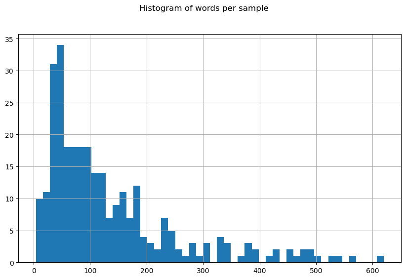
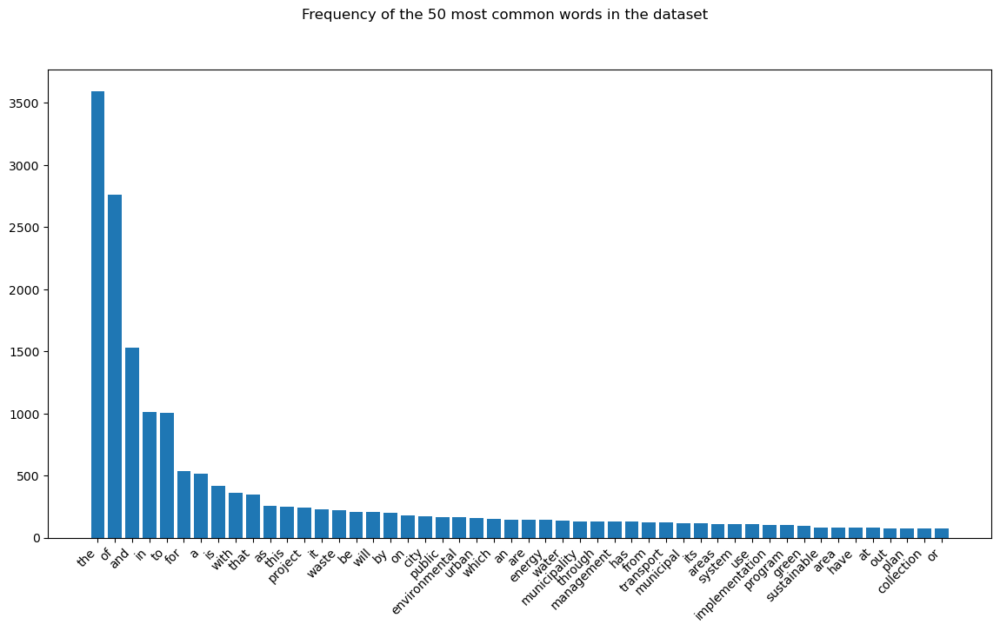

# Pesquisa - Project Hunter

Nesta pesquisa foram investigadas possíveis técnicas de classificação de projetos em categorias baseadas no título e descrição dos projetos. Foram investigadas majoritariamente técnicas de processamento de texto com IAs (NLP -- natural language processing).

## Metodologia

Primeiro, foi realizada uma pesquisa ampla para responder a algumas perguntas como:
- Quais técnicas, envolvendo ou não IA, são adequadas para o problema?
- A base de dados tem tamanho suficiente para aplicação de IA?
- Que tipos de entrada um modelo precisaria para ter bom desempenho?

Mais adiante, as perguntas serão detalhadas e respondidas. Em seguida, foram elencadas técnicas específicas de IA que se adequariam ao problema. Para cada técnica, foi realizada validação cruzada quando possível para determinar a performance de certas combinações de parâmetros e modelos. A validação cruzada consiste em separar `1` fold do dataset para servir de conjunto de teste e usar os `k-1` folds restantes como o conjunto de treino, em que `k` é o número total de folds. Este procedimento é então repetido de forma que todos os folds individuais sirvam de conjunto de teste uma única vez.

Por fim, os resultados foram registrados numa tabela e possíveis vias futuras foram analisadas.

## Experimentos e Resultados

As perguntas realizadas (e suas respostas) seguem abaixo:

1. Quais as soluções viáveis com e sem IA?
- Soluções sem IA envolveriam bastante processamento manual dos textos e modelamento estatístico do problema, e identificamos que não seria um caminho muito viável. Existem várias possíveis soluções com IA, e algumas foram elencadas para teste: 1) fine-tuning de modelo pré-treinado para geração de embeddings (vetorização) a partir do texto completo, 2) separação manual do texto em tokens (palavras ou conjuntos de palavras) para vetorização e 3) utilização da ferramenta ChatGPT.

2. Quais ferramentas seriam necessárias? Quais já estão prontas? Qual o custo? É necessário ter a tag? Dá para ir direto para a página?
- Para uma solução completa, seriam usadas ferramentas como Snowflake para hospedagem do banco de dados, Streamlit para apresentação dos resultados, AWS para hospedagem dos modelos e serviçoes de crawling e scraping e TensorFlow ou PyTorch como frameworks para treinamento e uso dos modelos. Snowflake e AWS seriam soluções pagas. Teriam de ser realizados testes futuros para utilizar uma página inteira como input de um modelo; nesta pesquisa foram realizados somente testes com títulos e descrições de projetos já existentes em uma base de dados.

3. Quais métodos estatísticos seriam importantes para redução campo amostral?
- Quantos menos palavras e quanto mais significativas as palavras que descrevem um projeto, melhor. Algo entre 5 e 50 tags poderiam ser geradas inicialmente e variáveis linearmente dependentes podem ser eliminadas com auxílio da correlação de Pearson, por exemplo.

4. Qual número mínimo de linhas o banco de dados precisa ter para as primeiras experimentações em: financiamento/impacto/categoria/cidade/ano/subcategoria?
- Esta é a pergunta mais complexa, uma vez que não existe resposta direta. No fundo, a quantidade de linhas depende do modelo estatístico que rege que o problema. Modelo este que não conhecemos e cuja modelagem é de alta dificuldade. Se o modelo for simples, podemos usar poucas features e relativamente poucas linhas, mas sendo um problema complexo, e fazendo-se o uso de IA, é necessário um banco grande. Duas estimativas empíricas foram elencadas: 5000 amostras por classe (baseado no livro [Deep Learning](https://www.deeplearningbook.org/)) ou 10x o número de graus de liberdade (parâmetros treináveis) do modelo. Esta última é mais incerta porque o modelo utilizado no fim das contas depende da complexidade estatística do problema, conforme dito antes. Foi chegada à conclusão de que pelo menos 1000 amostras no banco seria adequado para um teste inicial de ferramentas de IA.

5. Como a base deve ser montada (quantidade de tags, número de categorias) para maximizar a performance?
- Vide resposta acima.

6. Quais outputs são os mais fáceis de serem obtidos?
- Algumas variáveis são binárias e portanto de menor complexidade, como a classificação de projeto de impacto ou não ou classificação de financiamento social/verde/climático ou não. Outras saídas que podem ser obtidas com facilidade usando scraping são a cidade e o ano do projeto. Categoria e subcategoria do projeto são as saídas de maior complexidade.

Com essas respostas, a pesquisa se aprofundou na investigação de técnicas específicas de NLP para geração das categorias.

### Exploração e limpeza do dataset

Linhas com dados faltantes nas colunas de título, descrição ou categoria foram excluídas. Além disso, testes preliminares mostraram que utilizar todas as categorias disponíveis afetava muito negativamente a performance do modelo por conta do severo desbalanceamento. Com isso, os testes dessa pesquisa eliminaram categorias com menos de 20 amostras, restando o seguinte balanceamento de classes:

| area                    |   sample_count |
|:------------------------|---------------:|
| waste management        |             66 |
| water management        |             56 |
| transport               |             53 |
| other                   |             37 |
| public and green spaces |             27 |
| renewable energy        |             27 |
| energy efficiency       |             25 |

Foram gerados também um histograma do número de palavras por amostra e um gráfico de frequência das palavras mais recorrentes dos dados como um todo. Para isto, utilizou-se o título + descrição do projeto como input. Segua abaixo os gráficos gerados:

### Fine-tuning de modelos pré-treinados para extração de features

As técnicas utilizadas se baseiam nos tutoriais a seguir:
- https://www.tensorflow.org/tutorials/keras/text_classification
- https://www.tensorflow.org/tutorials/keras/text_classification_with_hub

O código se encontra no arquivo [cross_validation.ipynb](cross_validation.ipynb). Realizando uma busca por parâmetros e modelos ótimos com validação cruzada, foi obtida a tabela abaixo:

| input_column   | model_type   |   hidden_neurons |   score |
|:---------------|:-------------|-----------------:|--------:|
| desc           | nnlm128      |                0 |  0.6597 |
| desc           | nnlm128      |               32 |  0.6633 |
| desc           | nnlm128      |               64 |  0.6702 |
| desc           | use          |                0 |  0.6597 |
| desc           | use          |               32 |  0.6493 |
| desc           | use          |               64 |  0.6545 |
| title          | nnlm128      |                0 |  0.6016 |
| title          | nnlm128      |               32 |  0.6239 |
| title          | nnlm128      |               64 |  0.6342 |
| title          | use          |                0 |  0.6322 |
| title          | use          |               32 |  0.6256 |
| title          | use          |               64 |  0.6271 |
| title+desc     | nnlm128      |                0 |  0.7026 |
| title+desc     | nnlm128      |               32 |  0.7165 |
| title+desc     | nnlm128      |               64 |  0.7181 |
| title+desc     | use          |                0 |  0.7079 |
| title+desc     | use          |               32 |  0.6907 |
| title+desc     | use          |               64 |  0.7028 |

Temos também tabelas mais resumidas para análise de cada variável:

| input_column   |   score |
|:---------------|--------:|
| desc           |  0.6595 |
| title          |  0.6241 |
| title+desc     |  0.7064 |

Pode-se observar que a variável com maior impacto no desempenho foi a coluna escolhida como entrada do modelo. Ao utilizar informações de ambos o título e a descrição do projeto, pode-se obter desempenhos melhores do que usando cada um separadamente.

| model_type   |   score |
|:-------------|--------:|
| nnlm128      |  0.6656 |
| use          |  0.6611 |

No caso dos modelos, ambos [NNLM](https://tfhub.dev/google/nnlm-en-dim128-with-normalization/2) e [USE](https://tfhub.dev/google/universal-sentence-encoder/4), disponíveis no TensorFlow Hub, tiveram resultados promissores usando o título + descrição do projeto como entrada do modelo.

| hidden_neurons   |   score |
|:-----------------|--------:|
|                0 |  0.6606 |
|               32 |  0.6615 |
|               64 |  0.6678 |

O uso de uma camada intermediária entre as features e a saída parece se mostrar um bom aditivo, mas com um variação tão pequena de acurácia num dataset tão pequeno, é difícil tirar conclusões sólidas sem testes futuros. O número de épocas de treinado foi escolhido empiricamente e resultados melhores podem ser obtidos fazendo um posterior ajuste fino destes parâmetros e com uma base maior.

Infelizmente, o tamanho da base depois de limpeza foi de apenas 291 amostras, que limita as afirmações que podemos fazer quanto à possibilidade de usar IA no problema, mas um resultado próximo de 70% em validação cruzada indica que é uma boa ideia a realização de testes futuros com uma base de dados maior.

### Extração manual de tokens do texto para extração de features

As técnicas utilizadas se baseiam nos tutoriais a seguir:
- https://www.tensorflow.org/text/guide/word_embeddings?hl=en
- https://developers.google.com/machine-learning/guides/text-classification?hl=en

Novamente, o código se encontra no arquivo [cross_validation.ipynb](cross_validation.ipynb). Realizando uma busca por parâmetros ótimos com validação cruzada, foi obtida a tabela abaixo:

| input_column   | model_type   | num_features   |   score |
|:---------------|:-------------|:---------------|--------:|
| desc           | mlp          | 100            |  0.2923 |
| desc           | mlp          | 250            |  0.3992 |
| desc           | mlp          | all            |  0.1855 |
| desc           | rf           | 100            |  0.5157 |
| desc           | rf           | 250            |  0.4744 |
| desc           | rf           | all            |  0.1650 |
| desc           | xgb          | 100            |  0.4575 |
| desc           | xgb          | 250            |  0.4848 |
| desc           | xgb          | all            |  0.4302 |
| title          | mlp          | 100            |  0.4022 |
| title          | mlp          | 250            |  0.4403 |
| title          | mlp          | all            |  0.3371 |
| title          | rf           | 100            |  0.4299 |
| title          | rf           | 250            |  0.3542 |
| title          | rf           | all            |  0.2891 |
| title          | xgb          | 100            |  0.3439 |
| title          | xgb          | 250            |  0.2749 |
| title          | xgb          | all            |  0.2991 |
| title+desc     | mlp          | 100            |  0.3062 |
| title+desc     | mlp          | 250            |  0.4713 |
| title+desc     | mlp          | all            |  0.2234 |
| title+desc     | rf           | 100            |  0.5982 |
| title+desc     | rf           | 250            |  0.5742 |
| title+desc     | rf           | all            |  0.2065 |
| title+desc     | xgb          | 100            |  0.5568 |
| title+desc     | xgb          | 250            |  0.5603 |
| title+desc     | xgb          | all            |  0.4367 |

Novamente, agrupando as variáveis e usando a média das acuŕacias:

| input_column   |   score |
|:---------------|--------:|
| desc           |  0.3783 |
| title          |  0.3523 |
| title+desc     |  0.4371 |

Novamente, se observa que o uso do título + descrição do projeto gera modelos mais performáticos.

| model_type   |   score |
|:-------------|--------:|
| mlp          |  0.3397 |
| rf           |  0.4008 |
| xgb          |  0.4271 |

| num_features   |   score |
|:---------------|--------:|
| 100            |  0.4336 |
| 250            |  0.4482 |
| all            |  0.2858 |

Podemos notar que os resultados se mostram piores do que no caso anterior. Foram usados modelos mais comuns de machine learning (MLP, Random Forests e XGBoost) visto que a extração manual de features não gera entradas tão complexas quanto o uso completo do texto. Isso possivelmente se deve à dificuldade de gerar algoritmos de tokenização e escolha de features que envolvem processamento manual dos dados, ao invés de se utilizar um modelo pré-treinado como extrator de features, que é uma solução não só mais simples como mais performática. Uma desvantagem é que o uso de GPU é mais recomendado quando se utiliza um modelo pré-treinado robusto e complexo.

Novamente cabe observar que o número de amostras é pequeno e que é difícil tirar conclusões, mas muito possivelmente este é um caminho que não vale a pena ser perseguido.

### Uso de ChatGPT para classificação de páginas de projetos em categorias

O uso da ferramenta não foi investigado completamente a fundo visto que algumas partes da ferramente que podem ser mais promissoras são pagas, mas as queries abaixo mostram que há grande potencial em investigar essa linha.

Conclusão e Trabalhos Futuros

Possibilidades:

- Expansão do dataset (incluindo técnicas de data augmentation). Para obter conclusões mais certeiras sobre a possibilidade de uso de IA no problema é imprescindível o aumento da base de dados. O uso de IA é acometido pelo problema da dimensionalidade: são necessários muitos dados para geração de modelos performáticos e até mesmo para dizer se o uso de IA é possível ou não no problema. [Técnicas de data augmentation possíveis](https://neptune.ai/blog/data-augmentation-nlp) incluem traduzir os textos de um idioma para outro e depois do outro idioma para o original para que sejam criadas frases ligeramente diferentes. Além disso, palavras escolhidas aleatoriamente podem ser substituídas pro sinônimos para aumentar o banco artificialmente.

- Modelos pré-treinados servindo de extratores de features. Conforme observado nas tabelas, modelos como NNLM ou USE se mostraram bons extratores de features, conseguindo perto de 70% de acurácia antes de overfitting acontecer no treinamento. Com uma base de dados maior, é possível atingir ainda melhores resultados.

- Modelos treinados do zero a partir de features selecionadas. Estas foram as soluções que envolveram maior processamento manual (e elaboração manual do processo de extração) e que mostraram menor resultado. O maior poder do uso de IA é justamente na eliminação da etapa de processamento manual, e isso é indicado pelo melhores resultados obtidos com modelos pré-treinados.

- Soluções gratuitas ou pagas envolvendo ChatGPT. Como observado em algumas queries, a ferramenta ChatGPT da OpenAI oferece bastante potencial, mas é necessário entender em pesquisa futura que soluções gratuitas são possíveis e quais soluções pagas oferecem bom custo benefício. Existem opções como gerar [embeddings a partir de textos (ou tokens)](https://platform.openai.com/docs/guides/embeddings/what-are-embeddings) com a ferramenta ou realizar [fine-tuning dos modelos disponíveis na API](https://platform.openai.com/docs/guides/fine-tuning), mas ambas são opções pagas. Se pesquisas com o uso da ferramentas forem feitas, é possível até investigar se a ferramenta consegue trabalhar com uma página inteira de texto (ou somente com o link) e partir disso gerar classificações relevantes.
